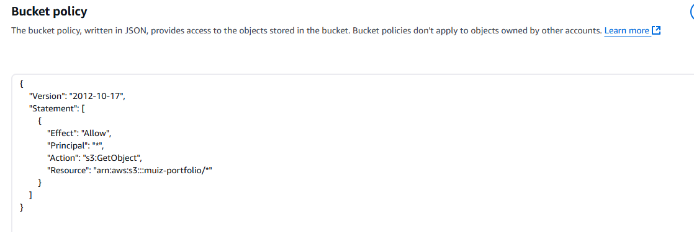

# Hosting a Static Website on AWS S3 - A Beginner's Portfolio Project

---

## **Overview**
This project demonstrates how to host a static website using **AWS S3**, a powerful and cost-effective storage solution provided by AWS. 

The goal of this project is to showcase:
- Your ability to configure and deploy a static website on AWS S3.
- Basic HTML/CSS skills.
- Familiarity with AWS services.

This README provides a step-by-step walkthrough with detailed screenshots and explanations for each step.

---

## **Prerequisites**
Before starting this project, make sure you have the following:
1. **AWS Account**:
   - You need an AWS account with S3 service access (AWS Restart Lab or Free Tier works perfectly for this project).

2. **Basic Knowledge**:
   - Familiarity with uploading files and navigating the AWS Management Console.
   - Basic understanding of HTML and CSS.

3. **Tools**:
   - A text editor like VS Code to edit files.
   - A browser to test your hosted website.

---

## **Steps to Host Your Static Website**

### **1. Create an S3 Bucket**
**Explanation**:
- Log in to the AWS Management Console.
- Navigate to the S3 service by searching "S3" in the top search bar.
- Click the **"Create Bucket"** button.
- Provide a unique name for your bucket (e.g., `muiz-portfolio`) and select your region.

**Screenshot**:

**Tip**:
- Make sure the bucket name is globally unique and follows AWS naming conventions.

---

### **2. Upload Your Website Files**
**Explanation**:
- Once the bucket is created, open it and go to the **"Upload"** section.
- Add all your website files, including `index.html`, `styles.css`, and any assets (like images).
- Click **"Upload"** to save your files in the bucket.

**Screenshot**:

---

### **3. Enable Static Website Hosting**
**Explanation**:
- In the bucket settings, go to the **"Properties"** tab.
- Scroll down to **"Static Website Hosting"** and enable it.
- Set the **index document** to `index.html`.

**Screenshot**:

**Warning**:
- Do not forget to save your changes after enabling static website hosting.

---

### **4. Configure Bucket Permissions**
**Explanation**:
- Go to the **"Permissions"** tab in your bucket settings.
- Edit the bucket policy to make the contents publicly accessible.

**Screenshot**:

---

### **5. Test Your Website**
**Explanation**:
- After configuring everything, copy the **Bucket Website Endpoint** from the static website hosting settings.
- Paste it into your browser to see your website live.

**Screenshot**:

**Troubleshooting**:
- If you see a "403 Forbidden" error, double-check your bucket policy and permissions.

---

## **Lessons Learned**
- **AWS S3 Setup**: Learned how to create, configure, and manage buckets effectively.
- **Static Website Hosting**: Gained a deeper understanding of static website hosting and public access configurations.
- **Problem-Solving**: Resolved a 403 Forbidden error by debugging the bucket policy.

---

## **Conclusion**
In this project, we successfully:
- Created and configured an S3 bucket.
- Uploaded and hosted a static website.
- Enabled public access and static website hosting features.

This project demonstrates basic skills in cloud computing and static web hosting, which are essential for a beginner in AWS.

---
